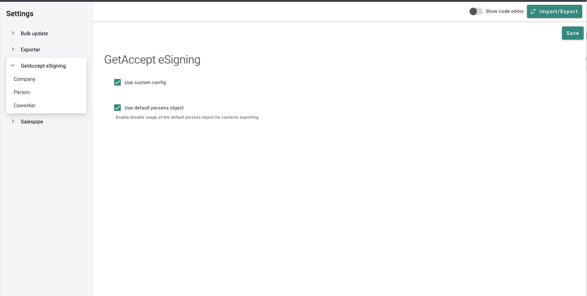
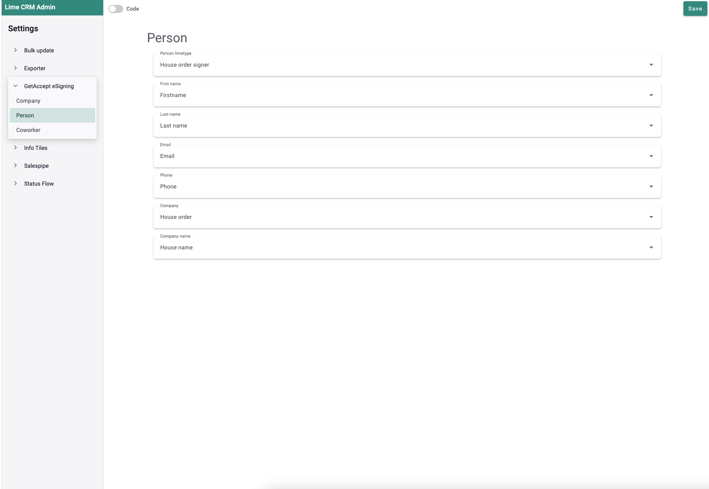

hero: Close your Lime CRM deals faster with GetAccept

# Configuration

In admin page you can setup custom object where addon should get info for sendout.
For that you need to go `webadmin` then to section `Settings` and enable `Use custom config`.

Then need to setup limeobjects links for custom config 

