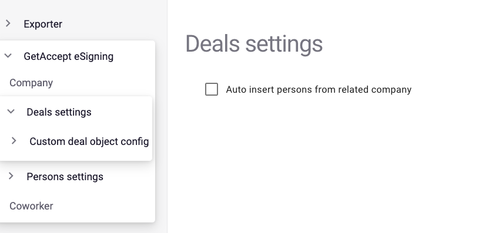
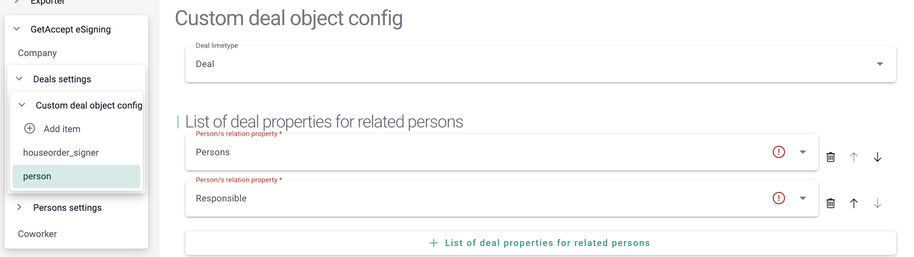
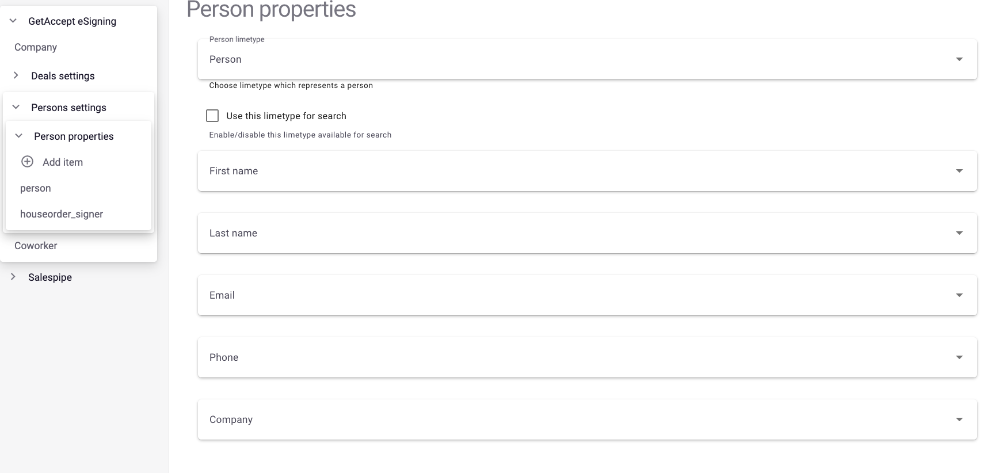

hero: Close your Lime CRM deals faster with GetAccept

# Configuration

In admin page you can setup custom object where addon should get info for sendout.
For that you need to go `webadmin` then to section `Settings` and enable `Use custom config`.

Then need to setup limeobjects links for custom config 

### Custom deal and person settings

In the 1.3.0 update, we added support for multi-object settings as well as limeobject settings for use as a deal. 

> [WARNING]
> After updating to version 1.3.0, the previous settings will break. For normal operation, it is necessary to clear the json with the settings and re-configure them

##### Deal settings
Here you can select auto inserting contacts from related company

##### Custom deal object config

By selecting the "Add Item" button, you can configure which limeobject will be used as a "deal" and what properties will be used to get contacts from them. The properties can be either OneToOneRelationship or OneToManyRelationship.

##### Person Properties

On the "Person properties" page, you must select which limeobject will be used as a "contact", as well as select the fields that are necessary for the addon to work.

